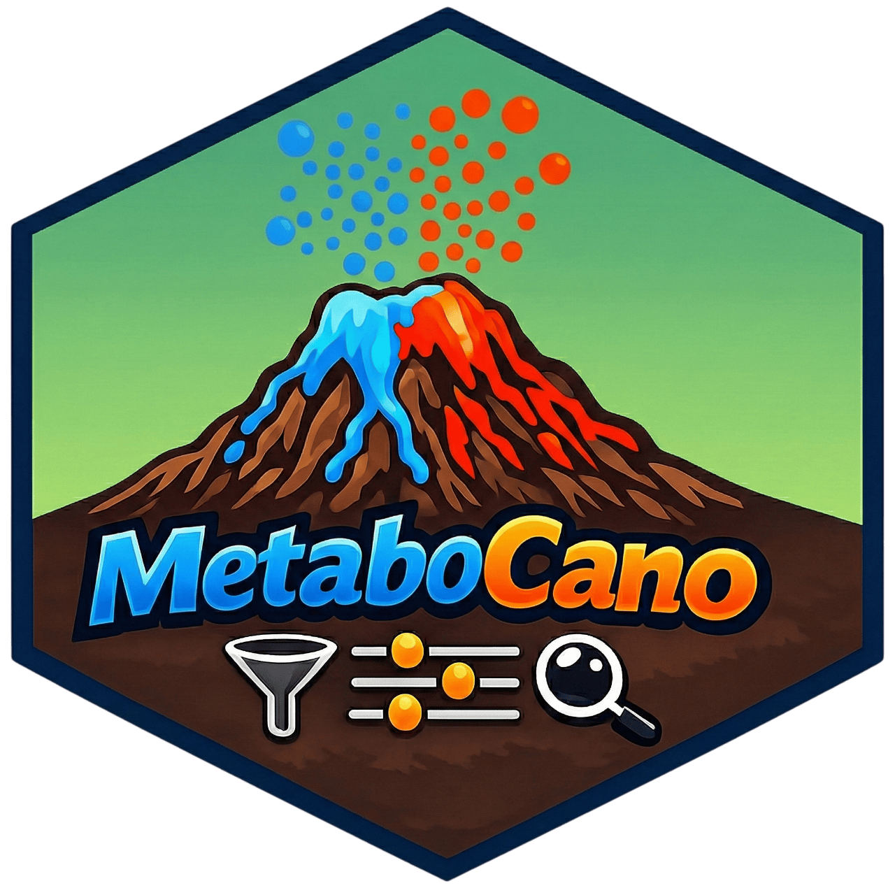

[](https://www.repostatus.org/#active)
[](https://cran.r-project.org/index.html)
[](https://choosealicense.com/licenses/gpl-3.0/)
# Metabocano 

### Description :bookmark_tabs:
The [`Shiny App`](https://shiny.posit.co/) for making an enhanced interactive volcano plot for metabolomics studies.
- Directly reads the output peak table from [`mzMine`](https://mzio.io/mzmine-news/), [`xcms`](https://www.bioconductor.org/packages/release/bioc/html/xcms.html), [`MS-DIAL`](https://systemsomicslab.github.io/compms/msdial/main.html), and Default format (see [`examples of inputs`](https://github.com/plyush1993/Metabocano/tree/main/toy_examples))
- Merges with the annotation results from [`SIRIUS`](https://bio.informatik.uni-jena.de/software/sirius/), [`GNPS`](https://gnps2.org/homepage)
- Intersects peak table with the annotation table from [`SIRIUS`](https://bio.informatik.uni-jena.de/software/sirius/), and Pairs List from [`GNPS`](https://gnps2.org/homepage)
- Performs imputation by noise, and statistical tests by group pairs
- Generates several outputs:
  - interactive [`Plotly`](https://plotly.com/)-type volcano plot with built-in filters, sliders, and formatting
  - table reformatted for [`MetaboAnalyst`](https://www.metaboanalyst.ca/home.xhtml) input
  - zip archive for [`AutoPlotter`](https://mpietzke.shinyapps.io/AutoPlotter/) *Compounds in Columns* input
  - table with statistics and [`SIRIUS`](https://bio.informatik.uni-jena.de/software/sirius/)/[`GNPS`](https://gnps2.org/homepage) annotations, which can be merged in [`Cytoscape`](https://cytoscape.org/) by *id* column comes from the used peak table

### Launch the App :rocket:
**Shiny deployment**<br>
[**`https://plyush1993.shinyapps.io/Metabocano/`**](https://plyush1993.shinyapps.io/Metabocano) <br><br>
**Run locally**<br>
Install:
```r
if (!require("BiocManager", quietly = TRUE)) {
    install.packages("BiocManager")
}
if (!require("remotes", quietly = TRUE)) {
    install.packages("remotes")
}
remotes::install_github("plyush1993/metabocano", INSTALL_opts = "--no-multiarch")
```
or
```r
if (!requireNamespace("pak", quietly = TRUE)) install.packages("pak")
pak::pak("plyush1993/metabocano")
```
Run:
```r
metabocano::run_metabocano()
```
<br>

> [!IMPORTANT]
>The App was compiled using [`R version 4.5.0`](https://cran.r-project.org/bin/windows/base/old/4.5.0/) 
<br>

### Contact :mailbox_with_mail:
Please send any comment, suggestion or question you may have to the author (Dr. Ivan Plyushchenko):  
<div> 
  <a href="mailto:plyushchenko.ivan@gmail.com"></a>
  <a href="https://github.com/plyush1993"></a>
  <a href="https://orcid.org/0000-0003-3883-4695"></a>
</div>

